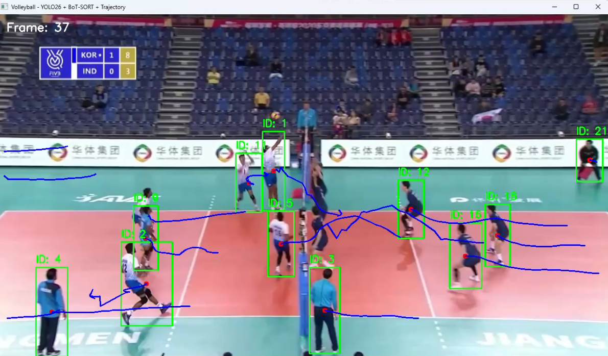

# 🏐 Volleyball Player Detection & Multi-Object Tracking

> YOLO26 + BoT-SORT 기반 배구 선수 검출 및 추적  
> OpenVINO INT8 양자화를 통한 모델 경량화 및 성능 비교

---

## 🎬 Result

### Player Detection & Multi-Object Tracking


YOLO26 기반 선수 검출과 BoT-SORT를 적용하여
배구 경기 영상에서 선수별 Track ID와 이동 궤적을 추적했습니다.

---

## 📊 Key Results

### Model Optimization

| Model | Size | FPS | Avg CPU |
|---|---:|---:|---:|
| PyTorch FP32 | 19.48 MB | 8.34 | 95.34% |
| OpenVINO FP32 | 36.70 MB | 5.15 | 97.91% |
| **OpenVINO INT8** | **10.05 MB** | **9.15** | **97.94%** |

### FP32 → INT8

- 모델 크기: **19.48 MB → 10.05 MB**
- 약 **48.4% 감소**
- FPS: **8.34 → 9.15**
- 약 **9.7% 증가**
- F1-score: **0.7779 → 0.7715**
- Mean IoU: **0.8705 → 0.8686**

양자화 이후 모델 크기를 줄이면서
동일 CPU 환경에서 추론 속도 변화를 측정하고,
검출 성능의 변화도 함께 비교했습니다.

---

## 📈 Tracking Evaluation

| Metric | Result |
|---|---:|
| HOTA | 47.36 |
| MOTA | 52.949 |
| IDF1 | 48.942 |
| IDSW | 43 |
| DetA | 54.92 |
| AssA | 40.899 |

---

## 📌프로젝트 개요

배구 경기 영상에서 선수(Player)를 자동으로 검출하고,
BoT-SORT 기반 Multi-Object Tracking을 적용하여 선수별 ID를 지속적으로 추적하는 프로젝트입니다.

또한 선수의 이동 궤적을 시각화하고,
FP32 모델을 OpenVINO INT8 모델로 양자화하여
경량화 전후의 모델 크기, 추론 속도, CPU 사용률 및 검출 성능을 비교했습니다.
# 🏐 Volleyball Player Detection & Multi-Object Tracking

> YOLO26 기반 배구 선수 검출 및 BoT-SORT 다중 객체 추적  
> FP32 → OpenVINO INT8 양자화를 통한 경량화 및 성능 비교

---
모델 크기, 추론 속도(FPS), CPU 사용률 및 검출 성능을 비교했습니다.

### 프로젝트 목표

- 배구 경기 영상 내 선수 검출
- YOLO26 기반 객체 검출
- BoT-SORT 기반 Multi-Object Tracking
- 선수별 Track ID 유지
- 선수 이동 궤적 시각화
- 검출 성능 평가
- Tracking 성능 평가
- FP32 → INT8 양자화
- 경량화 전후 성능 비교

---

## 🛠️ Tech Stack

| Category | Technology |
|---|---|
| Language | Python |
| Object Detection | YOLO26s |
| Object Tracking | BoT-SORT |
| Optimization | OpenVINO, NNCF |
| Computer Vision | OpenCV |
| Data Processing | NumPy, Pandas |
| Evaluation | Custom Evaluation, TrackEval |
| Visualization | Matplotlib |
| Environment | Anaconda, VS Code |

---

## 📂 Dataset

### SportsMOT

본 프로젝트에서는 스포츠 영상의 Multi-Object Tracking을 위한
**SportsMOT** 데이터셋을 사용했습니다.

SportsMOT는 Basketball, Football, Volleyball 등 스포츠 경기 영상에서
다중 객체를 추적하기 위한 데이터셋입니다.

본 실험에서는 Volleyball validation sequence 중

```text
v_9MHDmAMxO5I_c009
